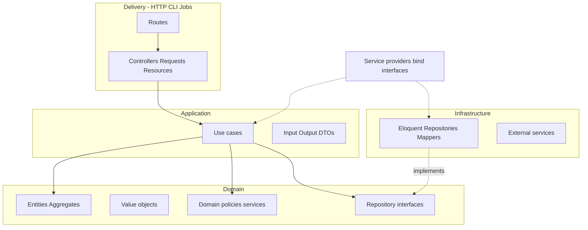

# Back-End Architecture (Laravel) — Clean Architecture & DDD

Definition of the **tradeup-api** (Laravel) architecture: **Clean Architecture** dependency rules combined with **Domain-Driven Design (DDD)** building blocks. The goal is a codebase where domain rules stay stable, use cases orchestrate application behavior, and framework details (Eloquent, HTTP, queues, mail) live at the edges.

## Overview

| Principle | What it means here |
|-----------|-------------------|
| **Dependency rule** | Source dependencies point **inward**. `Domain` knows nothing about Laravel, HTTP, or the database. `Application` knows `Domain` only. `Infrastructure` implements interfaces defined in `Domain` or `Application` and depends on frameworks. |
| **Ubiquitous language** | Names in PHP (classes, methods, modules) match how the product team talks about the problem. Avoid generic names (`Manager`, `Helper`, `Data`) when a domain term exists. |
| **Use cases first** | Each meaningful application capability is a **use case** (single purpose, clear input/output). HTTP controllers, jobs, and console commands are **thin** adapters that call use cases — they do not own business rules. |
| **Explicit boundaries** | **Domain** models invariants and policies. **Application** coordinates transactions and authorization checks at the application level. **Infrastructure** is swappable behind interfaces. |

This aligns with a **compact layering** common in small DDD-oriented codebases: **`domain`**, **`application`** (often `usecase` modules), **`infra`**, plus a **delivery** layer. In Laravel terms, delivery is `routes`, `Http`, console commands, and queued jobs — the surface that translates external protocols into use case calls.

---

## Layers and responsibilities

### Domain

**Owns:** business truth.

- **Entities / aggregates** — identity, lifecycle, consistency boundaries.
- **Value objects** — immutable, compared by value, validate themselves on construction.
- **Domain services** — pure domain logic that does not naturally belong on one entity.
- **Domain events** (optional) — facts that already happened inside the domain.
- **Repository interfaces (ports)** — persistence *contracts* the domain/application needs, **without** ORM types.

**Must not:** import Eloquent models, HTTP requests, framework facades tied to delivery, or hidden global config.

Suggested root: `app/Domain/<BoundedContext>/...` (start with one context; split when boundaries become obvious).

### Application

**Owns:** orchestration of domain objects to fulfill a user or system intent.

- **Use cases** (application services) — one class (or focused module) per capability: `RegisterUser`, `PlaceOrder`, etc.
- **Input / output DTOs** — plain data for use case boundaries (not Eloquent models).
- **Application ports** — interfaces for cross-cutting concerns (clock, id generator, outbox) when useful.
- **Transactions** — begin/commit at this layer (or a dedicated application helper), not scattered in controllers.

**May:** depend on `Domain` and abstractions. **Must not:** depend on concrete `Infrastructure` implementations.

Suggested root: `app/Application/<BoundedContext>/UseCases/...` (+ `DTOs`, `Ports` as needed).

### Infrastructure

**Owns:** technical details and integrations.

- **Persistence:** Eloquent models, mappers between DB rows and domain entities, repository **implementations**.
- **Messaging:** queue producers/consumers, mailers.
- **External APIs:** HTTP clients, webhook handlers that still delegate to use cases.
- **Framework** service providers binding interfaces to implementations.

Suggested root: `app/Infrastructure/<BoundedContext>/...` or cross-cutting `app/Infrastructure/Persistence/...` while the app is small.

### Presentation (delivery)

**Owns:** translating HTTP / CLI / jobs into use case invocations and back.

- **Controllers** — validate/authenticate at the edge (FormRequest / middleware), map request → input DTO, call use case, map result → JSON/resource.
- **API Resources** — presentation of data, not business rules.
- **Routes** — wiring only.

Laravel defaults (`app/Http`, `routes`) stay as the **outer shell**; shrink controller logic as use cases grow.

---

## Dependency flow (conceptual)



Solid lines are **allowed** dependencies inward. Infrastructure **implements** ports; binding happens at the composition root (`AppServiceProvider` or modular providers).

---

## Mapping to a minimal four-area layout

Many small backends group code like this:

| Area | Role | Laravel home (suggested) |
|------|------|---------------------------|
| **Domain** | Pure model and contracts | `app/Domain/...` |
| **Application / use case** | Orchestration per feature | `app/Application/.../UseCases` |
| **Infrastructure** | DB, queues, third parties | `app/Infrastructure/...` |
| **API / entry** | Expose use cases | `routes/*.php`, `app/Http/Controllers`, commands, jobs |

A single top-level “API module” in some stacks maps in Laravel to **routes + controllers**, with the same rule: **entry code routes traffic; the use case holds the behavior.**

---

## DDD building blocks (practical)

- **Entity** — has identity; state changes through methods that enforce rules.
- **Value object** — no identity; replace instead of mutate; validates invariants (`Money`, `Email`, `DateRange`).
- **Aggregate** — cluster with one root; external references go through the root; prefer one transactional boundary per aggregate change.
- **Repository** — collection-like interface for an aggregate; domain/application depend on the interface; infrastructure supplies `EloquentXRepository`.
- **Use case** — application operation; depends on repositories and domain services; returns **DTOs or domain objects** — avoid leaking Eloquent outside infrastructure.
- **Domain service** — stateless rule involving multiple entities/aggregates.

Start pragmatic: not every path needs a full aggregate graph. Add aggregates and domain events when consistency and side effects grow.

---

## tradeup-api conventions (today → target)

The API is a standard Laravel skeleton. When features land, prefer:

1. **New behavior** → new **use case** under `app/Application/...` before fattening controllers or Eloquent models.
2. **Persistence** → **repository interface** in `Domain` (or an `Application` port if you prefer stricter layering); **implementation** in `Infrastructure` with Eloquent.
3. **Validation** — HTTP validation at the edge; invariants that must **always** hold belong in entities/value objects.
4. **Naming** — use case named after intent: `CreateShipment`, not `ShipmentControllerService`.

### Example directory sketch

```text
tradeup-api/
  app/
    Domain/
      Identity/
        User.php                 # entity
        UserRepository.php       # interface
    Application/
      Identity/
        UseCases/
          RegisterUser.php
        DTOs/
          RegisterUserInput.php
    Infrastructure/
      Persistence/
        Eloquent/
          UserModel.php          # Eloquent model (can differ from domain User)
          EloquentUserRepository.php
    Http/
      Controllers/
        Auth/
          RegisterController.php
  routes/
    api.php
```

Use PSR-4 namespaces (`App\Domain\...`) via `composer.json` autoload.

### Testing

See **[tests.md](./tests.md)** for Pest, pyramid, doubles, and layer-by-layer guidance. In short:

- **Domain / Application:** Pest with **no** database when possible — pure tests for entities and use cases with **in-memory or fake** repositories.
- **Infrastructure:** integration tests for repository implementations against the database.
- **HTTP:** feature tests for routes; use fakes for external systems when needed.

For **SOLID**, style, and review habits aligned to these layers, see **[code-quality.md](./code-quality.md)**.

---

## What to avoid

- Business rules only in **controllers** or **FormRequest** — blocks reuse from jobs or CLI.
- **Eloquent models** as domain entities everywhere — couples all layers to Active Record.
- **God services** (`UserService` with many unrelated methods) — split by use case or subdomain.
- **Cross-layer shortcuts** — e.g. `DB::` or `Http::` inside a use case; hide behind an interface and inject.

---

## Relation to the mobile front-end

The React Native app uses **MVVM** and **Registry**-based injection (see [Front-End Architecture](../front-end/architecture.md)). The API should expose **stable, intention-revealing** endpoints aligned with use cases where practical, so mobile services map to server capabilities without persistence-driven JSON shapes.

---

## Summary

- **Domain:** entities, value objects, policies, repository **interfaces** — no framework coupling.
- **Application:** **use cases**, DTOs, transactions — orchestrates the domain.
- **Infrastructure:** Eloquent, integrations — implements ports.
- **Delivery (Laravel HTTP / CLI / jobs):** thin adapters calling use cases.

Evolve folder names as bounded contexts emerge; keep the **dependency rule** non-negotiable.
